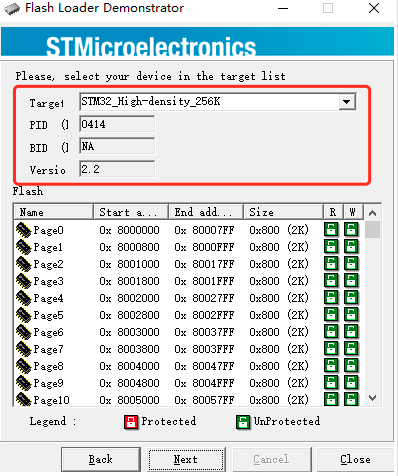
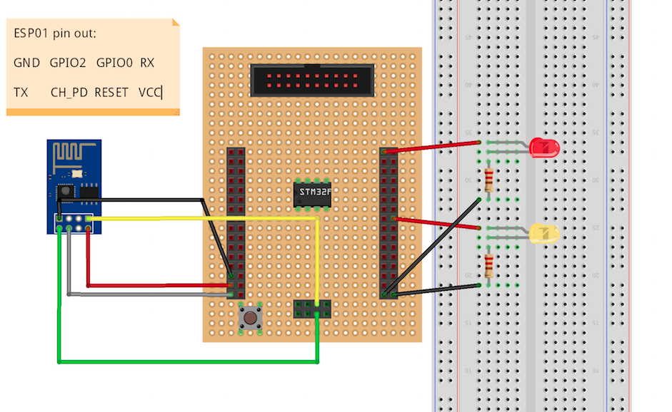

# 连接 STM32F103 到 Baidu IoT Hub

您可以使用**STM32F103**板子来快速开发一个连接到百度天工云平台的IOT应用。您只需要一块**STM32F103**板子以及一个**ESP01**wifi模块，以及若干杜邦线即可。STM32F10x是一款在嵌入式领域广受欢迎的廉价soc。外部可以连接众多传感器，非常适合IOT领域。

## 您将会了解到

* 如何创建一个百度IoT hub并且注册并且配置一个设备。
* 如何将我们的IOT设备通过wifi模块连接到百度IoT hub。
* 如何定时地发送传感器信息到您创建的百度IoT hub中。
* 如何准备开发环境。
* 如何移植百度`iot-sdk-c`到您自己的硬件平台。

如果您没有F103的板子以及ESP01模块怎么办? 最方便的是可以在淘宝购买，本教程使用的是这一款 STM32F103RCT6：

以及如下的 ESP01 模块：


工程源码包在当前目录下 **STM32F103RC_with_ESP01.tar.bz2**。

## 需要材料

* 一块 STM32F103RCT6 开发板。
* 一根 micro USB 线。
* 一块面包板。
* 一根 usb-to-TTL 串口线。
* 一个 ESP01 模块。
* 两个发光二极管。
* 两个470欧限流电阻。
* 一些杜邦线。
* 一台安装windows系统的开发电脑。
* keil 5软件。
* 一个百度账号。

## 创建一个物影子

如果您还不了解**物模型** **物影子**的概念，可以参考[官方文档](https://cloud.baidu.com/doc/IOT/s/mjwvy6tpe)。接下来就step by step 创建一个云端物影子。

### a. 计价策略

首先，需要用户在百度云创建物接入资源。在此之前您需要了解下百度天工物接入的计价策略。
百度天工物接入采用**阶梯计费**的方式。

用户拥有100万条/月免费的消息额度。所以对于您的测试是**完全免费**的。

### b. 登陆注册

在使用物接入服务前，您需要创建一个**百度账号**或**百度智能云账号**，请按照下述步骤进行注册和登录。
* 1. 注册并登录百度[智能云平台](https://login.bce.baidu.com/)。
* 2. 使用物接入服务，必须进行实名认证。
    
 
对于个人客户，点击**个人认证**，需要上传身份证正反面照片。耐心等待人工审核。
* 3. 登录成功后，导航栏选择“**产品服务** > **物联网服务** > **物接入IoT Hub**”，即可开始使用物接入服务。

### c. 创建计费套餐

在创建项目之前应先创建计费套餐并设定每个月收发消息的额度，系统将根据额度自动计算每个月的服务费用。这里我们只是作为测试，直接享受100W/月的免费额度。

### d. 创建项目

连接物接入服务需要先创建一个项目，每个项目会为您对应一个**接入点（endpoint）**。一个项目表示一个完整的物接入服务。
登录物接入控制台页面，点击**创建项目**，填写需要创建 IoT Hub 服务的项目名称、选择项目类型，这里选择**设备型**并提交即可。通过项目可以将不同项目的设备进行隔离和管理。


### e. 创建物模型

通过**物模型**可以为设备定义一套属性模板，在创建物影子时可以引用该模板，实现业务的快速部署。具体操作方法如下：
* 1. 返回项目列表，点击刚才创建的项目名称，接入项目详情页。选择**物模型**，进入物模型卡片列表；点击**新建物模型**进入物模型配置界面。
    
* 2. 填写物模型配置，包括名称、描述和属性。创建成功后物模型名称和属性名称无法修改，同一物模型下属性名称必须唯一。这里我们的物模型叫`monitor`。点击“添加属性”为物模型新增一条`temperature`的属性。 
    
以此类推，我们再创建两个属性：`humidity` `led`。
    
点击**创建**。模型列表中就可以看到成功创建的模型了。
    

### f. 创建物影子

有了物模型，就可以创建物影子了。

点击设备型项目的项目名称，选择**物影子**，进入物影子卡片列表；点击**新建物影子**进入物模型配置界面。按照下图创建一个物影子，`myMonitor`,需要注意的是，在**选择物模型**下拉按钮中，选择刚才我们创建的物模型`monitor`。是否开启存储配置，表示数据是否存储百度时序数据库——TSDB，这里我们选择“OFF”。点击“创建”。
    
之后，就会返回一个带有连接信息的窗口，复制保存这些信息，之后在编译Demo代码时会用到这些信息。
    
物接入提供了三种连接方式：
* TCP：TCP 传输（不安全），通过`用户名` `密码`鉴权。
* TLS：基于证书的单向SSL认证，保证数据链路的安全，通过`用户名` `密码`鉴权。
* WSS：通过websocket方式，通过用户名 密码鉴权。

返回`物影子`列表，发现影子已经成功创建了。
    
注意到，设备现在是离线状态，因为我们还没有连接。

至此，您已经按照文档创建了一个**设备型**项目，并且创建了一个**物模型**叫`monitor`，并且基于该物模型创建了一个**物影子**叫`myMonitor`。同时也获取到了**连接信息**，云端的操作就完成了。现在就可以开始设置硬件连接了。
## 设置硬件连接

### 设置烧写 STM32F103

准备好如下器材开始烧写我们的Demo程序: `usb-to-TTL 串口线` `4根杜邦线` `micro USB 线`。

1. 解压源码

   1. 源码已经在当前目录下 `STM32F103RC_with_ESP01.tar.bz2`。建议拷贝到根目录下，否则目录层级太深win7中keil工程编译会出错。

   2. 解压该压缩包。

2. 加载工程

   1. 该demo是用`KEIL 5`软件开发编译的，如果您没有安装`KEIL 5`软件，请至[官网](https://www2.keil.com/mdk5)下载安装。

   2. 双击打开工程文件`STM32F103RC_with_ESP01\USER\STM32F103_IOTHUB.uvprojx`
   

3. 编译程序

   1. 在编译之前，我们需要根据得到的连接信息，简单修改一下程序。
   
   2. 我们的物影子名称为“myMonitor”。并且我们已经拿到连接信息，如下图：
```
TCP Address： tcp://abcedefg.mqtt.iot.gz.baidubce.com:1883
SSL Address： ssl://abcedefg.mqtt.iot.gz.baidubce.com:1884
WSS Address： wss://abcedefg.mqtt.iot.gz.baidubce.com:443
name：abcedefg/myMonitor
key：xxxxxxxxx
```

之后我们就可以用该信息连接 baidu 天工云平台了。
修改源码iotdm_client_sample.c，添加我们连接信息以及物影子信息：
```
// 填写从百度云申请的 endpoint 信息，我们选择`TCP`方式
#define         ADDRESS             "tcp://abcedefg.mqtt.iot.gz.baidubce.com:1883"

// 填写申请到的物影子名称
#define         DEVICE              "myMonitor"

// 填写用户名
#define         USERNAME            "abcedefg/myMonitor"

// 填写密码
#define         PASSWORD            "xxxxxxxxx"

```
这样，程序就修改OK了。
   
   3. 点击"Rebuild"按钮。开始编译：
   

   4. 编译完成，会在`OBJ`目录下生成hex文件，我们之后烧录的就是这个文件：
   

3. 烧写hex文件到 STM32F103RCT6 板子上，这里通过`串口ISP`下载方式。烧写软件可以从[官网](https://www.st.com/zh/development-tools/flasher-stm32.html)下载安装。

4. 如下图用micro USB线 把`STM32F103RCT6开发板`和`电脑`相连。
 

5. 如下图用`杜邦线`在板子上的对应引脚进行连接，同时连接 `usb-to-TTL 串口线`。黑色usb线的另一端连接电脑USB口即可。
 
 

6. 打开烧录软件，选择对应的 COM 口。其他设置默认即可。打开板载电源开关按钮，点击“Next”。
 

7. 如果成功检测到硬件型号，会出现如下界面，点击“Next”。
 

8. 列出了更加详细的信息，点击“Next”。
 

9. 选择烧录文件，我们之前编译生成的hex文件。点击“Next”。
 

10. 之后就是烧录过程了，耐性等待烧录完成。点击“Close”。
 

### 设置烧写 ESP01

**STM32F103**板子没有联网功能，我们借助于**ESP01**模块进行网络传输。ESP01是一款廉价，小巧的wifi芯片，通过烧录**AT固件**，可以直接通过**串口AT命令**进行：路由器连接，TCP连接，数据透传等功能。**STM32F103**板子通过和**ESP01**模块的集成，可以完成云端的连接任务。

一般芯片在出厂时默认就会烧录AT固件，所以您可以直接使用。如果您需要升级AT固件或者芯片中没有固件，则需要自行烧录，具体方法可以参考乐鑫文档。在此不再赘述。

### 最终硬件连接

原材料一切就绪之后，就可以开始最终硬件整合了。通过面包板、杜邦线，我们需要把LED小灯，STM32F103，ESP01模块连接起来。



为了电路连接的简单，我们没有再添加温湿度传感器，而是在程序中发送模拟随机温湿度值。两个发光二极管的作用，第一个二极管用来作为系统正常运行的信号灯，正常会闪烁，用来判断FreeRTOS系统是正常运行。第二个二极管用来作为云端反控的一个工具。可以用来控制“亮”或“灭”。

以下是 面包板 和 板子 的连接:

| Start (breadboard)))     | End (Board)            | Cable Color   |
| -----------------------  | ---------------------- | ------------: |
| 面包板 LED1 VDD           | PD02                   | Red cable     |
| 面包板 LED1 GND           | GND                    | Black cable   |
| 面包板 LED2 VDD           | PA08                   | Red cable     |
| 面包板 LED2 GND           | GND                    | Black cable   |

以下是 ESP01 和 板子 的连接：

| Start (ESP01)            | End (Board)            | Cable Color   |
| -----------------------  | ---------------------- | ------------: |
| ESP01 VCC                | 3.3V                   | Red cable     |
| ESP01 RX                 | PA09                   | Yellow cable  |
| ESP01 TX                 | PA10                   | Green cable   |
| ESP01 CH_PD              | 3.3V                   | Grey cable    |
| ESP01 GND                | GND                    | Black cable   |

   > [!NOTE]
   > 如果您想观察程序打印输出，可以用USB-to-TTL串口线的`RX`口 连接 板子的`PA02`，波特率为115200。


最终实物图如下：


## 运行 & 测试

### 登陆控制台

登陆您的控制台，点击您刚才创建的`物影子`，可以发现每隔5s会上报一个温度、湿度的更新值。


### 设备反控

您也可以在属性页面改变`led`属性的状态，如设置成“1”，发现LED2被点亮。设置成“0”，发现LED2熄灭。


## 移植百度 iot-sdk-c
该Demo使用到的源码包其实是通过百度`iot-sdk-c`移植过来的，如果您希望移植该sdk到其他硬件平台，可以参考当前目录下的`STM32F103移植手册.md`。