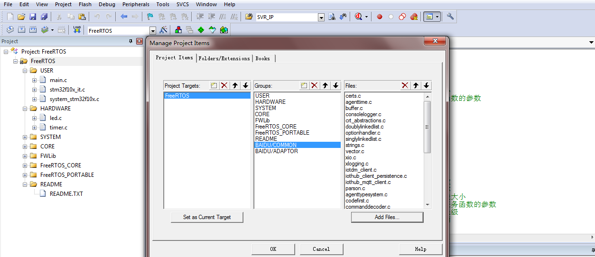
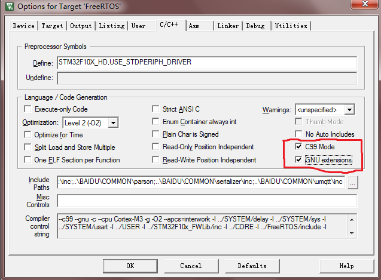

该文档描述了如何将百度 iot-sdk-c 移植到 STM32F103 板子上，并且连接到Baidu天工云平台。由于 STM32F103 没有网络接口，无法网络传输，
这里，我们使用串口wifi芯片 ESP8266 和云端进行数据收发。


## 1. 移植准备
关于FreeRtos 在 stm32f103 上的移植，此处不再赘述，可以参考相关移植文档。    
这个板子的基本信息：
```
内　　核：Cortex-M3 32-bit RISC；
工作频率：72MHz，1.25 DMIPS/MHz；工作电压：2-3.6V；
封　　装：LQFP64；I/O口：64；
存储资源：256kB Flash，48kB RAM
接口资源：2xSPI，5xUSART，1xI2S，2xI2C；
　　　　　1xLCD，1xSDIO，1xUSB，1xCAN；
模数转换：3xAD（12位，1us，分时16通道），2xDA（12位）；
调试下载：支持JTAG/SWD接口的调试下载，支持IAP。
```

## 2. 下载 iot-sdk-c
github地址：https://github.com/baidu/iot-sdk-c

## 3. 拷贝源文件
将源文件拷贝到工程目录中。
运行脚本：
```
C:\stm32> copy_src_to_keil_stm32.bat [iot-sdk-c的相对路径]  [拷贝目标文件夹路径] 
```
发现工程中多出一个 BAIDU 文件夹，里面有两个子文件夹：COMMON 和 ADAPTOR 。
前者包含通用文件，后者包含需要适配的文件，稍后提供。


## 4. 编译
现在就可以编译了，在keil工程中添加两个子目录："BAIDU/COMMON" 和 "BAIDU/ADAPTOR"，把所有的.c文件都添加入"BAIDU/COMMON"中。
如下图所示：


然后添加头文件目录：点击“魔法棒”->"C/C++"，添加如下头文件目录：
```
..\BAIDU\COMMON\certs;..\BAIDU\COMMON\c-utility\inc;..\BAIDU\COMMON\iothub_client\inc;..\BAIDU\COMMON\parson;..\BAIDU\COMMON\serializer\inc;..\BAIDU\COMMON\umqtt\inc
```

**注意**    
iot-sdk-c 需要**C99**支持，以及**GNU扩展**支持，还需要勾选**use microlib**选项。如下所示：

发现报错：
```
..\OBJ\LED.axf: Error: L6218E: Undefined symbol time (referred from agenttime.o).
..\OBJ\LED.axf: Error: L6218E: Undefined symbol ThreadAPI_Sleep (referred from iotdm_client.o).
..\OBJ\LED.axf: Error: L6218E: Undefined symbol platform_get_default_tlsio (referred from iothub_mqtt_client.o).
..\OBJ\LED.axf: Error: L6218E: Undefined symbol socketio_get_interface_description (referred from iothub_mqtt_client.o).
..\OBJ\LED.axf: Error: L6218E: Undefined symbol tickcounter_create (referred from iothub_mqtt_client.o).
..\OBJ\LED.axf: Error: L6218E: Undefined symbol tickcounter_destroy (referred from iothub_mqtt_client.o).
..\OBJ\LED.axf: Error: L6218E: Undefined symbol tickcounter_get_current_ms (referred from iothub_mqtt_client.o).
```
如我们所料，正需要我们实现那5个 adaptor 接口即可。针对不同的系统，我们只需要提供这些适配器接口的实现就可以了。关于完整的适配器接口说明，参考：[文档](https://github.com/baidu/iot-edge-c-sdk/blob/master/PortingGuide.md)

## 5. 引入 adaptor 模块
这里我们提供了一个针对STM32F103 + ESP01的实现：
```
platform_STM32F103.c      # 提供 platform_get_default_tlsio socketio_get_interface_description 实现
system_pal.h          
tlsio_mbedtls_STM32F103.c # 提供 TLS 传输接口，这里用不到
socketio_STM32F103.c      # 提供 TCP 传输接口，我们使用串口WIFI芯片作为网络接口
threadapi_STM32F103.c     # 提供 ThreadAPI_Sleep 实现，替换为 FreeRTOS 中的延时函数
system_pal.c              # 提供 time函数 FreeRTOS中内存分配函数的映射
tickcounter_STM32F103.c   # 提供 tickcounter_xxx 函数的实现
```
放入 ADAPTOR 文件夹下。具体源码可以参考`STM32F103RC_with_ESP01.tar.bz2`。

## 6. 其他修改
添加 `system_pal.h` `system_pal.c` 用来实现操作系统相关的`malloc` `free` 等函数映射，在freeRtos中，我们需要使用`pvPortMalloc` `vPortFree`
来进行内存分配释放。    
修改 COMMON ADAPTOR 中 所有的.c 文件，加入`system_pal.h` 头文件包含：
```
#include "system_pal.h"
```
除此之外，还需要修改`parson.c`中，注释掉以下`undef`语句：
```

//#undef malloc
//#undef free

```

sdk代码移植部分结束。

## 7. 整合ESP01模块
主要是设置两个串口，USART1用来和ESP01通过AT指令集通讯，完成连接百度天工iothub，USART2用来打印debug。
这部分驱动代码放在了`STM32F103RC_with_ESP01\ESP8266-STM32F103`目录下。

## 8. 创建云端影子
在README中已有详细步骤，此处不再赘述。我们的物影子名称为“myMonitor”。并且我们已经拿到连接信息，如下图：
```
TCP Address： tcp://abcedefg.mqtt.iot.gz.baidubce.com:1883
SSL Address： ssl://abcedefg.mqtt.iot.gz.baidubce.com:1884
WSS Address： wss://abcedefg.mqtt.iot.gz.baidubce.com:443
name：abcedefg/myMonitor
key：xxxxxxxxx
```

之后我们就可以用该信息连接 baidu 天工云平台了。
修改源码iotdm_client_sample.c，添加我们连接信息以及物模型信息：
```
// 填写从百度云申请的 endpoint 信息，我们选择`TCP`方式
#define         ADDRESS             "tcp://abcedefg.mqtt.iot.gz.baidubce.com:1883"

// 填写申请到的物影子名称
#define         DEVICE              "myMonitor"

// 填写用户名
#define         USERNAME            "abcedefg/myMonitor"

// 填写密码
#define         PASSWORD            "xxxxxxxxx"

// 填写物模型信息
BEGIN_NAMESPACE(BaiduIotMqttThing);
// 定义物模型结构体，结构体名称叫'BaiduSerializableIotMqttDev_t'
DECLARE_MODEL(BaiduSerializableIotMqttDev_t,
    WITH_DATA(float, temperature),
    WITH_DATA(float, humidity),
	WITH_DATA(int, led)
  );

END_NAMESPACE(BaiduIotMqttThing);


// ......

// 修改主程序中定时上报逻辑
// 创建一个model，并填入模拟的温湿度数值
BaiduSerializableIotMqttDev_t* mdl = CREATE_MODEL_INSTANCE(BaiduIotMqttThing, BaiduSerializableIotMqttDev_t, true);
mdl->temperature = 20 + rand() % 10;
mdl->humidity = 50 + rand() % 10;
mdl->led = ledState;

// 序列化成json字符串
SERIALIZE(&reported, &reportedSize, *mdl)


// 上报消息
iotdm_client_update_shadow_with_binary(handle, DEVICE, "123456", 0, reportedString, NULL)
```
