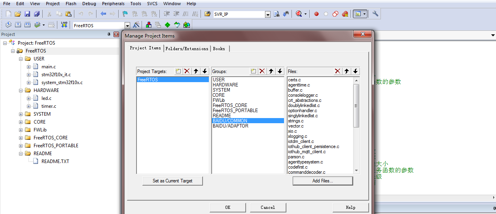
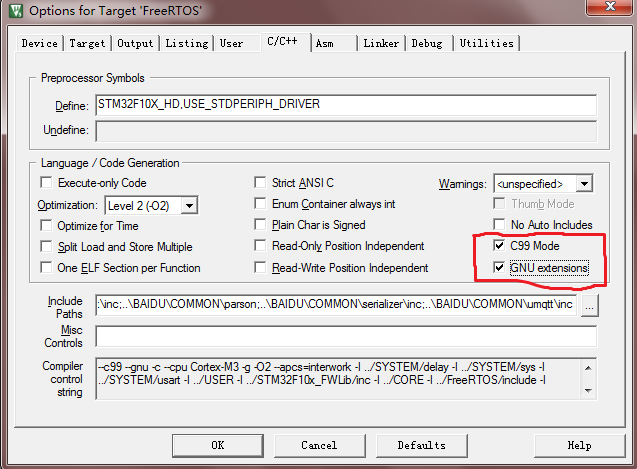

该文档描述了如何将百度 baidu-iot-sdk-c 移植到 STM32F103 板子上，并且连接到Baidu天工云平台。由于 STM32F103 没有网络接口，无法网络传输，
这里，我们使用串口wifi芯片 ESP8266 和云端进行数据收发。


## 1. 移植准备
关于FreeRtos 在 stm32f103 上的移植，此处不再赘述，可以参考相关移植文档。    
这个板子的基本信息：
```
内　　核：Cortex-M3 32-bit RISC；
工作频率：72MHz，1.25 DMIPS/MHz；工作电压：2-3.6V；
封　　装：LQFP64；I/O口：64；
存储资源：256kB Flash，48kB RAM（方便移植UCGUI LWIP等等占用资源比较多的协议包 可以开发更强大的程序）
接口资源：2xSPI，5xUSART，1xI2S，2xI2C；
　　　　　1xLCD，1xSDIO，1xUSB，1xCAN；
模数转换：3xAD（12位，1us，分时16通道），2xDA（12位）；
调试下载：支持JTAG/SWD接口的调试下载，支持IAP。
```

## 2. 下载 baidu-iot-sdk-c
github地址：https://github.com/baidu/iot-edge-c-sdk

## 3. 拷贝源文件
将源文件拷贝到工程目录中。
运行脚本：
```
C:\stm32> copy_src_to_keil_stm32.bat [baidu-iot-sdk-c的相对路径]  [拷贝目标文件夹路径] 
```
发现工程中多出一个 BAIDU 文件夹，里面有两个子文件夹：COMMON 和 ADAPTOR 。
前者包含通用文件，后者包含需要适配的文件，稍后提供。


## 4. 编译
现在就可以编译了，在keil工程中添加两个子目录："BAIDU/COMMON" 和 "BAIDU/ADAPTOR"，把所有的.c文件都添加入"BAIDU/COMMON"中。
如下图所示：


然后添加头文件目录：点击“魔法棒”->"C/C++"，添加如下头文件目录：
```
..\BAIDU\COMMON\certs;..\BAIDU\COMMON\c-utility\inc;..\BAIDU\COMMON\iothub_client\inc;..\BAIDU\COMMON\parson;..\BAIDU\COMMON\serializer\inc;..\BAIDU\COMMON\umqtt\inc
```

**注意**
baidu-iot-sdk-c 需要“C99”支持，以及“GNU扩展”支持，还需要勾选"use microlib"选项。如下所示：

发现报错：
```
..\OBJ\LED.axf: Error: L6218E: Undefined symbol time (referred from agenttime.o).
..\OBJ\LED.axf: Error: L6218E: Undefined symbol ThreadAPI_Sleep (referred from iotdm_client.o).
..\OBJ\LED.axf: Error: L6218E: Undefined symbol platform_get_default_tlsio (referred from iothub_mqtt_client.o).
..\OBJ\LED.axf: Error: L6218E: Undefined symbol socketio_get_interface_description (referred from iothub_mqtt_client.o).
..\OBJ\LED.axf: Error: L6218E: Undefined symbol tickcounter_create (referred from iothub_mqtt_client.o).
..\OBJ\LED.axf: Error: L6218E: Undefined symbol tickcounter_destroy (referred from iothub_mqtt_client.o).
..\OBJ\LED.axf: Error: L6218E: Undefined symbol tickcounter_get_current_ms (referred from iothub_mqtt_client.o).
```
如我们所料，正需要我们实现那5个 adaptor 接口即可。针对不同的系统，我们只需要提供这些适配器接口的实现就可以了。关于完整的适配器接口说明，参考：[文档](https://github.com/baidu/iot-edge-c-sdk/blob/master/PortingGuide.md)

## 5. 引入 adaptor 模块
这里我们提供了一个针对STM32F103 + ESP01的实现：
```
platform_STM32F103.c      # 提供 platform_get_default_tlsio socketio_get_interface_description 实现
system_pal.h          
tlsio_mbedtls_STM32F103.c # 提供 TLS 传输接口，这里用不到
socketio_STM32F103.c      # 提供 TCP 传输接口，我们使用串口WIFI芯片作为网络接口
threadapi_STM32F103.c     # 提供 ThreadAPI_Sleep 实现，替换为 FreeRTOS 中的延时函数
system_pal.c              # 提供 time函数 FreeRTOS中内存分配函数的映射
tickcounter_STM32F103.c   # 提供 tickcounter_xxx 函数的实现
```
放入 ADAPTOR 文件夹下。具体源码可以参考`STM32F102RC_with_ESP01.tar.bz2`。

## 6. 其他修改
添加 `system_pal.h` `system_pal.c` 用来实现操作系统相关的`malloc` `free` 等函数映射，在freeRtos中，我们需要使用`pvPortMalloc` `vPortFree`
来进行内存分配释放。    
修改 COMMON ADAPTOR 中 所有的.c 文件，加入`system_pal.h` 头文件包含：
```
#include "system_pal.h"
```

sdk代码移植部分结束。

## 7. 整合ESP01模块
这块设置比较多，就不是移植的范畴了。主要是设置两个串口，USART1用来和ESP01通过AT指令集通讯，完成连接百度天工iothub，USART2用来打印debug。
整个工程已经放在`STM32F102RC_with_ESP01.tar.bz2`。供大家参考。最终效果图如下：


## 8. 资源消耗
RAM 消耗大约5K。

FLASH消耗：
O2 + no sdk:
Program Size: Code=19824 RO-data=412 RW-data=188 ZI-data=22604  --> 42.9

O2 + sdk:
Program Size: Code=117144 RO-data=21292 RW-data=724 ZI-data=23188  --> 162.1   (sdk 占用flash：119.2 = 162.1 - 42.9)

O1 O2 O3 随着等级越高，优化的项目越多，生成的目标文件也会裁小，编译时间越来越长，但是代码执行的速度是越来越快。

加上 `NO_LOGGING` 编译选项可以大大减少code size:
Program Size: Code=74592 RO-data=8780 RW-data=704 ZI-data=23192  --> 107  (sdk 占用 flash: 64 = 107 - 42.9)

故，sdk至少需要占用70K左右的flash。


## 9. FAQ
1. 编译报错 ..\OBJ\LED.axf: Error: L6200E: Symbol __stdout multiply defined (by stdio_streams.o and usart.o).
```
baidu-iot-sdk-c 中的parson中使用了"fopen"函数，需要勾选"use microlib"选项。然后屏蔽掉usart.c中半主机相关代码。
```

2. Demo工程在断网的情况下会有内存泄漏！
```
Demo工程对于发送失败的消息会缓存在列表中，所以当离线消息越来越多内存就会严重消耗，后续可以优化。
```

